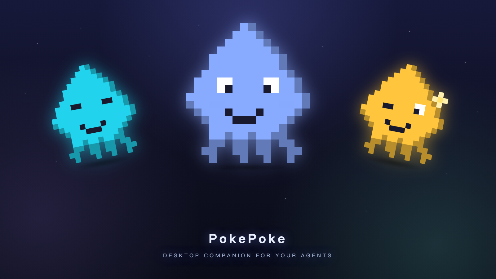

# PokePoke

### Never miss the moment your coding agent needs you.

PokePoke is a macOS menu-bar tool that watches **Claude Code**, **Cursor**, and **Codex CLI** from your menu bar — then nudges you when a session is waiting, done, or stuck.

[**↓ Download for macOS**](https://github.com/hellokidder/PokePoke/releases/latest) · [**Website**](https://pokepoke.app) · [**Privacy**](https://pokepoke.app/privacy.html) · [**Terms**](https://pokepoke.app/terms.html)

---

## The problem

Agents run ahead. You start one, switch to another task, and come back twenty minutes later to find it was waiting the whole time. PokePoke turns those stalled moments into visible, audible attention signals — so you stop babysitting terminals.

## How it works

PokePoke is built around one loop:

| | Step | What happens |
|---|---|---|
| **1** | **Hook event** | PokePoke listens when your agent starts, waits, stops, or fails. |
| **2** | **Session state** | Running, pending, idle, and failed sessions stay visible in the menu bar. |
| **3** | **Nudge** | A corner popup + system alert sound bring the moment back to you. |
| **4** | **Jump back** | Click the alert or press `⌘N` to return to the exact terminal or IDE window. |

The popup **stays on screen until you act** — switch spaces, grab coffee, come back, it's still there. That's the whole bet: less elegant than a notch animation, much harder to ignore.

## Integrations

Connect the agents you already use. PokePoke writes user-level hook config and keeps every signal in one menu-bar panel.

| Agent | Hooks |
|---|---|
| **Claude Code** | `SessionStart` / `UserPromptSubmit` / `Notification` / `Stop` / `StopFailure` |
| **Cursor** | `sessionStart` / `beforeSubmitPrompt` / `stop` / `sessionEnd` |
| **Codex CLI** | `SessionStart` / `UserPromptSubmit` / `Stop` |

**Terminal jump** lands on the right window — not just any terminal: **iTerm2**, **Terminal.app**, **Ghostty**, and **Cursor**.

## Privacy — local-first

Everything PokePoke tracks lives on your machine under `~/.pokepoke/`. Hooks talk to the app over a local Unix socket.

- All session data stays on-device. Nothing is sent to our servers.
- No prompts, no logs, no code, no terminal output ever leaves your Mac.
- No account, no sign-in. The only outbound call is license activation with [Creem](https://www.creem.io).

## Pricing

| | Free | Pro |
|---|---|---|
| Desktop notifications | Up to 20 / day | **Unlimited** |
| Terminal jump | Basic | **Unlimited** |
| Integrations | All | All |

**Pro** — $1.99/mo or $19.99 one-time lifetime. License activation is handled through Creem; the key is stored in the macOS Keychain.

→ [Get Pro at pokepoke.app](https://pokepoke.app/#pricing)

## Install

1. [Download the latest `.dmg`](https://github.com/hellokidder/PokePoke/releases/latest) (Apple Silicon).
2. Open it and drag PokePoke to Applications.
3. Launch PokePoke — it lives in your menu bar. Connect your agents from the panel.

Updates are delivered in-app via the built-in updater.

## Links

- **Website:** [pokepoke.app](https://pokepoke.app)
- **Releases:** [github.com/hellokidder/PokePoke/releases](https://github.com/hellokidder/PokePoke/releases)
- **Privacy Policy:** [pokepoke.app/privacy.html](https://pokepoke.app/privacy.html)
- **Terms of Service:** [pokepoke.app/terms.html](https://pokepoke.app/terms.html)
- **Refund Policy:** [pokepoke.app/refund.html](https://pokepoke.app/refund.html)
- **Contact:** hellokiddermail@gmail.com

---

This repository hosts binary releases. PokePoke's source code is proprietary.

